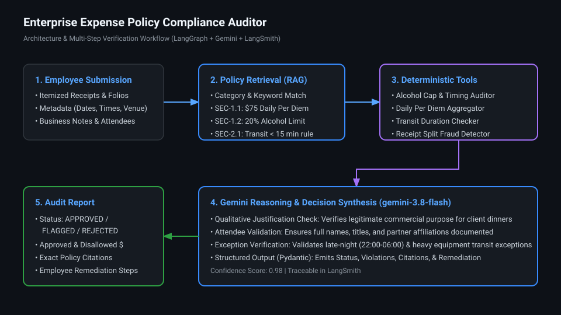

# Enterprise Expense Policy Compliance Auditor

[](https://www.python.org/downloads/)
[](https://github.com/langchain-ai/langgraph)
[](https://smith.langchain.com/)
[](https://deepmind.google/technologies/gemini/)
[](https://docs.astral.sh/uv/)

An enterprise-grade compliance auditor for corporate travel and entertainment (T&E) expense reports. Combines **Retrieval-Augmented Generation (RAG)**, **deterministic calculation tools**, **Google Gemini** (`gemini-3.8-flash` / `gemini-3.5-flash-lite`), and **LangGraph StateGraph** to inspect employee expense submissions with financial accuracy.

---

## 1. Problem & Architecture

### The Problem
Corporate expense compliance policies are nuanced and difficult to enforce with simple rule engines:
- **$75.00 Daily Per Diem**: Soft targets for breakfast/lunch, but strict cap per calendar day.
- **20% Alcohol Cap**: Alcohol charges must not exceed 20% of meal subtotal; strictly prohibited during solo breakfast or lunch.
- **Ground Transit Rules**: Rideshares (Uber/Lyft/Taxi) disallowed if public transit is under 15 minutes, with exceptions for late-night travel (10 PM–6 AM) or bulky business equipment (>30 lbs).
- **Client Entertainment**: Requires itemized bills, full attendee names/titles/affiliations, detailed business justifications, and a strict $150.00/person ceiling.
- **Anti-Fraud**: Prohibits artificial receipt splitting to evade approval caps.

### Architecture Overview



The system is built as a multi-step **LangGraph StateGraph**:
1. **Pydantic Validation**: Ingests and normalizes expense reports, receipts, and line items.
2. **Policy Retrieval (RAG)**: Indexes and retrieves exact policy clauses with section citations from `docs/policy_document.md`.
3. **Deterministic Audit Tools**: Computes exact arithmetic for alcohol caps, daily per diem aggregation across multiple receipts, transit feasibility, and split receipts in pure Python—eliminating LLM arithmetic hallucinations.
4. **Qualitative Reasoning (Gemini 3.8 Flash)**: Analyzes subjective elements (commercial justification adequacy, attendee completeness, exception legitimacy).
5. **Structured Audit Output**: Emits a strongly-typed `AuditResult` (`APPROVED`, `FLAGGED_FOR_REVIEW`, or `REJECTED`) with disallowed dollar amounts and actionable remediation notes for employees.

---

## 2. The Iterative Journey: Build → Evaluate → Learn → Improve

In accordance with the take-home specification, this project followed an iterative progression:

```
[ Build Initial Agent ] ──> [ Evaluate (25 Cases) ] ──> [ Learn Failure Modes ] ──> [ Improve (LangGraph + Tools) ] ──> [ 100% Pass Rate ]
```

### Initial Evaluation (Baseline Agent V1)
We first built a direct RAG-prompted agent (`expense_auditor/agent.py`) and benchmarked it against a curated dataset of 25 realistic claims across 5 operational slices:
- **Status Accuracy**: 100.0%
- **Disallowed Amount Accuracy**: 88.0% (Failed 3 cases: TC-06, TC-09, TC-10)
- **Clear Violations Pass Rate**: 40.0%

### What We Learned (Trace & Error Analysis)
1. **Arithmetic Double-Counting (TC-06)**: When an expense contained both excess alcohol and an overall per diem overage, the LLM double-counted deductions ($55 vs $50), penalizing the employee twice on food and drink.
2. **Pre-Tax vs Post-Tax Tax Extrapolation (TC-10)**: For a hotel exceeding the $200 rate cap, the LLM invented a proportional tax deduction ($171 total disallowed instead of $150 room rate overage).
3. **Market Tier Confusion (TC-09)**: The baseline agent failed to identify Washington D.C. as a Tier 1 metropolitan area when specified by venue rather than state abbreviation.
4. **Per Diem vs Hosting Mix-ups (TC-03, TC-20)**: The LLM occasionally applied the $75 solo meal cap to client hosting dinners rather than the $150/person attendee cap.

### The Improvement (Advanced Agent V2)
We decoupled arithmetic and qualitative checks by creating:
- Deterministic Python tools in `src/expense_auditor/tools/` for alcohol ratio calculation, daily per diem summing, and transit threshold verification.
- A **LangGraph StateGraph** pipeline conditioning qualitative LLM reasoning on pre-computed deterministic figures.

---

## 3. Evaluation Results: Before vs. After

Evaluated across **25 curated test cases** in `evaluation/dataset.json`:

| Metric | Baseline Agent (V1) | Improved LangGraph (V2) | Delta |
| :--- | :---: | :---: | :---: |
| **Status Decision Accuracy** | 100.0% | **100.0%** | `+0.0%` |
| **Disallowed Amount Accuracy** | 88.0% | **100.0%** | `+12.0%` |
| **Policy Citation Recall** | 100.0% | **100.0%** | `+0.0%` |
| **Overall Deterministic Pass Rate** | 88.0% | **100.0%** | `+12.0%` |
| **LLM Judge Groundedness (1-5)** | 4.92 / 5.0 | **5.00 / 5.0** | `+0.08` |
| **LLM Judge Actionability (1-5)** | 5.00 / 5.0 | **5.00 / 5.0** | `0.00` |
| **LLM Judge Agreement Rate** | 96.0% | **100.0%** | `+4.0%` |

### Performance by Operational Slice

| Operational Slice | Total Cases | Baseline Pass | Improved Pass | Delta |
| :--- | :---: | :---: | :---: | :---: |
| `clean_compliant` | 5 | 100.0% | **100.0%** | `+0.0%` |
| `clear_violations` | 5 | 60.0% | **100.0%** | `+40.0%` |
| `transit_edge_cases` | 5 | 100.0% | **100.0%** | `+0.0%` |
| `client_entertainment_and_docs` | 5 | 80.0% | **100.0%** | `+20.0%` |
| `subtle_evasions_and_math` | 5 | 100.0% | **100.0%** | `+0.0%` |

Detailed case-by-case error analysis is available in [`docs/evaluation_report.md`](docs/evaluation_report.md).

---

## 4. Quickstart

### Prerequisites
- Python 3.12+
- [uv](https://docs.astral.sh/uv/) package manager

### Setup

```bash
# 1. Clone repository
git clone https://github.com/oliverfederico/enterprise-expense-auditor.git
cd enterprise-expense-auditor

# 2. Install dependencies via uv
make install

# 3. Configure environment
cp .env.example .env
# Set GOOGLE_API_KEY in .env
```

### Run an Expense Audit

Audit a sample expense report using the CLI with rich terminal formatting:

```bash
# Audit a compliant report
uv run python -m expense_auditor.cli examples/sample_compliant.json

# Audit a report with violations (excess alcohol + unauthorized rideshare)
uv run python -m expense_auditor.cli examples/sample_violation.json

# Output as raw JSON (suitable for piping into accounting systems)
uv run python -m expense_auditor.cli examples/sample_violation.json --json
```

### Run Evaluations & Compare

```bash
# Run unit test suite
make test

# Run full evaluation benchmark
uv run python -m evaluation.run_eval --engine advanced

# Generate before-and-after comparison report
uv run python -m evaluation.compare_results
```

---

## 5. LangSmith Observability & Tracing

When `LANGCHAIN_TRACING_V2=true` and `LANGCHAIN_API_KEY` are configured in `.env`, all audit runs and evaluations automatically trace into LangSmith with intermediate node inspectability, latency tracking, and LLM Judge scoring.

### 🔗 Public Trace Deep-Dives (Zero-Login / View-Only)
You can directly inspect the live execution graphs, intermediate node states, and LLM Judge evaluations in LangSmith using these public links:
- [Multi-Violation Audit Trace (TC-06)](https://smith.langchain.com/public/6188afa2-45f0-4f41-bcd1-f8dc990a405c/r): Full StateGraph execution catching alcohol and per diem caps via deterministic Python tools before qualitative synthesis.
- [Anti-Fraud Split-Receipt Detection Trace (TC-21)](https://smith.langchain.com/public/d220931d-00d0-40a9-b24e-d4340193df2a/r): Demonstrates cross-receipt temporal aggregation detecting approval-cap evasion.
- [Contextual Transit Exception Trace (TC-11)](https://smith.langchain.com/public/4d80f13c-c3db-4f60-b995-7334268bfa79/r): Shows reasoning through late-night rideshare exceptions.
- [Clean Compliant Auto-Approval Trace (TC-01)](https://smith.langchain.com/public/61a39aee-f08e-40b0-9a4e-dac13b03be31/r): Fast-path compliant claim verification with zero false positives.
- [LLM-as-a-Judge Evaluation Trace (TC-06)](https://smith.langchain.com/public/e21f5e68-3f95-4462-8923-3fb469c366a8/r): Live run of the ComplianceLLMJudge grading policy groundedness and remediation actionability.

---

## 6. Production Evaluation & Deployment Roadmap

In enterprise production, automated financial auditing requires defensive deployment safeguards:

1. **Phase 1: Shadow Mode (Months 1–2)**:
   - Run the auditor in parallel with human finance analysts on 100% of claims without taking automated action.
   - Track precision/recall against human decisions. Maintain false rejection rate < 0.5%.
2. **Phase 2: Confidence-Tiered Human-in-the-Loop Triage (Month 3+)**:
   - **Auto-Approve**: Claims under $100 with 100% itemized receipts, no alcohol, and high confidence (>0.95) are auto-approved.
   - **Triage Queue**: Flagged claims route to finance staff with pre-drafted violation notes and employee remediation guidance.
3. **Phase 3: Continuous Online Monitoring & Policy Drift**:
   - **Continuous Sampling**: 5% of production traces are evaluated by online LLM judges for groundedness and citation validity.
   - **Appeal Feedback Loop**: When employees dispute an audit flag, the claim is saved as an edge-case regression fixture.
   - **Policy Change CI/CD**: When HR/Finance updates `policy_document.md`, the evaluation suite runs automatically in CI/CD before any prompt or embedding update is deployed.

---

## 7. Known Tradeoffs & Limitations

- **Multimodal OCR**: Currently, the system expects parsed receipt text or structured JSON. In production, an upstream vision OCR model (e.g. Gemini Vision) would extract messy handwritten receipts into this Pydantic schema.
- **Dynamic Transit API Integration**: Transit durations are currently evaluated from itinerary notes or route lookup tables; integrating a live Google Maps Transit API would provide real-time route verification.
- **Multi-Currency Fluctuation**: Foreign receipts currently assume spot conversion; production integration should connect to a live daily exchange rate feed (e.g., OANDA/Bloomberg).

---

## 8. AI Assistance & Development Workflow

In alignment with modern software engineering practices and the exercise guidelines, AI coding assistance was utilized during the development of this auditor.

### Where AI Assisted
- **Boilerplate & Model Scaffolding**: Fast generation of Pydantic schemas (`Receipt`, `ExpenseReport`, `AuditResult`) and basic typing structures.
- **RAG & Graph Wiring**: Structuring LangGraph `StateGraph` nodes and implementing in-memory vector/keyword retrieval for policy clauses.
- **Evaluation Dataset Synthesis**: Assisting in creating realistic synthetic corporate expense scenarios, receipts, and line items across 5 diverse operational slices.
- **Terminal UI & Visualization**: Drafting Rich terminal output tables and the SVG architecture diagram.

### What Was Manually Verified & Engineered by the Author
- **Domain Accounting Logic**: Identifying that naive LLM reasoning double-counts overlapping deductions (e.g. alcohol overage + per diem cap). Designed and implemented the deterministic math tools (`math_tools.py`) to sequence calculations correctly (alcohol excess disallowed first, daily per diem applied to remaining balance).
- **Audit Rule Separation**: Diagnosing why client entertainment claims failed under solo meal per diems; manually decoupling individual per diem rules (SEC-1.1) from group entertainment per-person caps (SEC-3.2).
- **Ground Truth Validation**: Personally verifying and calibrating all 25 test cases in `evaluation/dataset.json` against company policy to ensure expected disallowed figures, citations, and status outcomes were mathematically exact.
- **Unit Testing & Guardrails**: Authoring unit test suites (`tests/test_math_tools.py`, `tests/test_transit_tools.py`) to verify arithmetic caps, late-night transit exceptions, and heavy-equipment thresholds independently of LLM calls.
- **Judge Rubrics & Calibration**: Crafting the multi-dimensional evaluation rubric (Policy Groundedness, Actionability, and Agreement) for the LLM judge to prevent subjective scoring drift.

